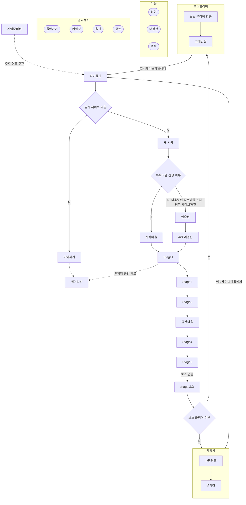

# Portfolio_TGB
## 게임명: The Greatest BlackSmith
>장르 : 2D 플랫포머 어드밴처 로그라이크  
>플랫폼 : PC   
>제작의도 : Skul:the hero slayer에서 영감을 받아 제작한 플랫포머 로그라이크, 아이템 효과에 중점을 두고 개발   

  

## 플로우차트

## 타이틀씬

>새게임, 이어하기(세이브파일), 해금 아이템 리스트, 옵션, 나가기    
  

## 마을    

>NPC: 상인, 대장간, 축복   
>상인: 임시 재화를 사용, 해금되어있는 아이템 중 아이템 등급에 따라 차등된 가격으로 판매, 재입고 가능, 재입고 시 재입고 비용 증가   
>대장간: 임시 재화를 사용, 무기를 변경할 수 있음.   
>축복: 영구 재화를 사용, 영구적인 스탯 증가.

  

## 스테이지

>좌측 상단: 플레이타임, 남은 적 수   
>좌측 하단: 체력, 스킬1, 스킬2
>중앙 하단: 버프, 디버프 표시
>우측 하단: 임시 재화, 영구 재화, 미니맵

  

* * *
## 적용 기술

### 오브젝트 풀링   
오브젝트를 생성하고 파괴하는 작업은 메모리를 할당하고 파괴 시 가비지컬렉팅으로 인한 프레임 저하가 일어 날 수 있기에 오브젝트 풀링 기법으로 가비지 컬렉팅을 최소화하여 성능을 향상시켰습니다.   

### 스프라이트 아틀라스 에셋 사용   
드로우콜을 줄이기 위해 단일 텍스쳐를 호출함으로 써 하나의 드로우콜로 큰 성능 소모없이 패킹된 텍스쳐를 동시에 액세스 할 수 있음.   

### FSM   
유닛(플레이어, 적)들에 상태 제어를 FSM으로 함으로써 어떤 상태를 동작하는지 명확하게 파악 할 수 있고 구현 및 제어가 쉬운 장점이 있어 사용했습니다.   

### 컴포넌트 패턴   
유닛의 각 기능들을 컴포넌트화 하여 느슨한 구조로 추가 및 삭제가 용이하고 재사용할 수 있어 코드의 길이을 줄일 수 있었습니다.   

### 샌드박스 패턴
아이템 효과를 구현하기 위해 특정 상태에 따라 호출되는 함수가 상이하며 상위 클래스가 하위 클래스가 필요로 하는 기능을 제공할 수 있고, 하위 클래스들간 겹치는 행동이 많아 샌드박스 패턴을 사용하였습니다.
>중복 제공: 아이템 이펙트, 사운드, 실행   
>아이템 이펙트 호출: 아이템 효과과 발동 시에 호출 
>아이템 사운드 호출: 아이템 효과가 발동 시에 호출
>실행: 각 아이템 효과에 맞게 호출됨. 호출할 상태는 Enum으로 관리
>  
>
>
>>예시:OnDamaged(피해입을 시 호출), OnMoveScene(씬[스테이지] 이동 시 호출), OnAction(공격 시도 시), OnHit(공격 히트 시), OnDodge(공격 회피 시)... 등등   
>>각 아이템 효과는 발동 확률 및 발동에 필요한 횟수, 쿨타임 등을 설정하여 다양한 아이템을 만들어 낼 수 있습니다.

